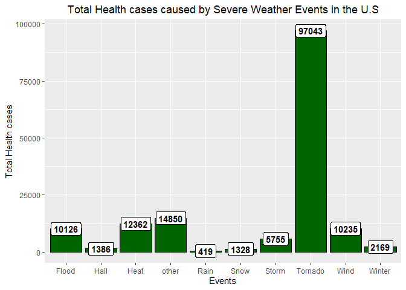
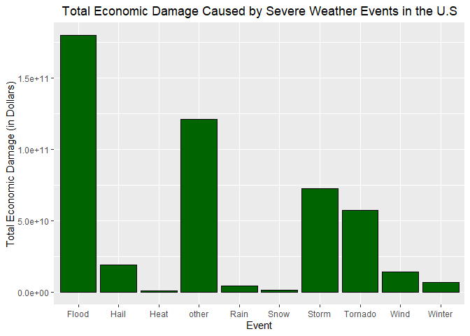

# Exploration of Storms and other severe weather events and their impacts on Public Health and Economy in the United States.  

## Snopsys

This report aims to calculate the total damage on both Public Health and Economy in the United States. Severe weather events can cause fatalities, injuries as well as it can negatively impact Economy of countries.  
This project involves exploring the U.S. National Oceanic and Atmospheric Administration's (NOAA) storm database. This database tracks characteristics of major storms and weather events in the United States, including when and where they occur, as well as estimates of any fatalities, injuries, and property damage.

## Data Processing

The raw data was obtained from [Storm Data](https://d396qusza40orc.cloudfront.net/repdata%2Fdata%2FStormData.csv.bz2).  

There is also some documentation of the database available. Here you will find how some of the variables are constructed/defined:  
* National Weather service. [Storm Data Documentation](https://d396qusza40orc.cloudfront.net/repdata%2Fpeer2_doc%2Fpd01016005curr.pdf)  
* National Climatic Data Center Storm Events. [FAQ](https://d396qusza40orc.cloudfront.net/repdata%2Fpeer2_doc%2FNCDC%20Storm%20Events-FAQ%20Page.pdf)

### Reading in the data
The following 3 R codes are downloading the raw data set and readin in it to the global environment for further analysis.

```r
URL <- "https://d396qusza40orc.cloudfront.net/repdata%2Fdata%2FStormData.csv.bz2"
download.file(url = URL, destfile = "stormdata.csv.bz2")
data <- read.csv("stormdata.csv.bz2")
```

Now we will do some basic exploration in order to get an overview of the data set.


```r
dim(data)
```

```
## [1] 902297     37
```
As we can see the dataset has 902297 rows (observations) and 37 columns.  
Lets do some more exploration.


```r
str(data)
```

```
## 'data.frame':	902297 obs. of  37 variables:
##  $ STATE__   : num  1 1 1 1 1 1 1 1 1 1 ...
##  $ BGN_DATE  : Factor w/ 16335 levels "1/1/1966 0:00:00",..: 6523 6523 4242 11116 2224 2224 2260 383 3980 3980 ...
##  $ BGN_TIME  : Factor w/ 3608 levels "00:00:00 AM",..: 272 287 2705 1683 2584 3186 242 1683 3186 3186 ...
##  $ TIME_ZONE : Factor w/ 22 levels "ADT","AKS","AST",..: 7 7 7 7 7 7 7 7 7 7 ...
##  $ COUNTY    : num  97 3 57 89 43 77 9 123 125 57 ...
##  $ COUNTYNAME: Factor w/ 29601 levels "","5NM E OF MACKINAC BRIDGE TO PRESQUE ISLE LT MI",..: 13513 1873 4598 10592 4372 10094 1973 23873 24418 4598 ...
##  $ STATE     : Factor w/ 72 levels "AK","AL","AM",..: 2 2 2 2 2 2 2 2 2 2 ...
##  $ EVTYPE    : Factor w/ 985 levels "   HIGH SURF ADVISORY",..: 834 834 834 834 834 834 834 834 834 834 ...
##  $ BGN_RANGE : num  0 0 0 0 0 0 0 0 0 0 ...
##  $ BGN_AZI   : Factor w/ 35 levels "","  N"," NW",..: 1 1 1 1 1 1 1 1 1 1 ...
##  $ BGN_LOCATI: Factor w/ 54429 levels "","- 1 N Albion",..: 1 1 1 1 1 1 1 1 1 1 ...
##  $ END_DATE  : Factor w/ 6663 levels "","1/1/1993 0:00:00",..: 1 1 1 1 1 1 1 1 1 1 ...
##  $ END_TIME  : Factor w/ 3647 levels ""," 0900CST",..: 1 1 1 1 1 1 1 1 1 1 ...
##  $ COUNTY_END: num  0 0 0 0 0 0 0 0 0 0 ...
##  $ COUNTYENDN: logi  NA NA NA NA NA NA ...
##  $ END_RANGE : num  0 0 0 0 0 0 0 0 0 0 ...
##  $ END_AZI   : Factor w/ 24 levels "","E","ENE","ESE",..: 1 1 1 1 1 1 1 1 1 1 ...
##  $ END_LOCATI: Factor w/ 34506 levels "","- .5 NNW",..: 1 1 1 1 1 1 1 1 1 1 ...
##  $ LENGTH    : num  14 2 0.1 0 0 1.5 1.5 0 3.3 2.3 ...
##  $ WIDTH     : num  100 150 123 100 150 177 33 33 100 100 ...
##  $ F         : int  3 2 2 2 2 2 2 1 3 3 ...
##  $ MAG       : num  0 0 0 0 0 0 0 0 0 0 ...
##  $ FATALITIES: num  0 0 0 0 0 0 0 0 1 0 ...
##  $ INJURIES  : num  15 0 2 2 2 6 1 0 14 0 ...
##  $ PROPDMG   : num  25 2.5 25 2.5 2.5 2.5 2.5 2.5 25 25 ...
##  $ PROPDMGEXP: Factor w/ 19 levels "","-","?","+",..: 17 17 17 17 17 17 17 17 17 17 ...
##  $ CROPDMG   : num  0 0 0 0 0 0 0 0 0 0 ...
##  $ CROPDMGEXP: Factor w/ 9 levels "","?","0","2",..: 1 1 1 1 1 1 1 1 1 1 ...
##  $ WFO       : Factor w/ 542 levels ""," CI","$AC",..: 1 1 1 1 1 1 1 1 1 1 ...
##  $ STATEOFFIC: Factor w/ 250 levels "","ALABAMA, Central",..: 1 1 1 1 1 1 1 1 1 1 ...
##  $ ZONENAMES : Factor w/ 25112 levels "","                                                                                                               "| __truncated__,..: 1 1 1 1 1 1 1 1 1 1 ...
##  $ LATITUDE  : num  3040 3042 3340 3458 3412 ...
##  $ LONGITUDE : num  8812 8755 8742 8626 8642 ...
##  $ LATITUDE_E: num  3051 0 0 0 0 ...
##  $ LONGITUDE_: num  8806 0 0 0 0 ...
##  $ REMARKS   : Factor w/ 436781 levels "","-2 at Deer Park\n",..: 1 1 1 1 1 1 1 1 1 1 ...
##  $ REFNUM    : num  1 2 3 4 5 6 7 8 9 10 ...
```

```r
head(data)
```

```
##   STATE__           BGN_DATE BGN_TIME TIME_ZONE COUNTY COUNTYNAME STATE
## 1       1  4/18/1950 0:00:00     0130       CST     97     MOBILE    AL
## 2       1  4/18/1950 0:00:00     0145       CST      3    BALDWIN    AL
## 3       1  2/20/1951 0:00:00     1600       CST     57    FAYETTE    AL
## 4       1   6/8/1951 0:00:00     0900       CST     89    MADISON    AL
## 5       1 11/15/1951 0:00:00     1500       CST     43    CULLMAN    AL
## 6       1 11/15/1951 0:00:00     2000       CST     77 LAUDERDALE    AL
##    EVTYPE BGN_RANGE BGN_AZI BGN_LOCATI END_DATE END_TIME COUNTY_END
## 1 TORNADO         0                                               0
## 2 TORNADO         0                                               0
## 3 TORNADO         0                                               0
## 4 TORNADO         0                                               0
## 5 TORNADO         0                                               0
## 6 TORNADO         0                                               0
##   COUNTYENDN END_RANGE END_AZI END_LOCATI LENGTH WIDTH F MAG FATALITIES
## 1         NA         0                      14.0   100 3   0          0
## 2         NA         0                       2.0   150 2   0          0
## 3         NA         0                       0.1   123 2   0          0
## 4         NA         0                       0.0   100 2   0          0
## 5         NA         0                       0.0   150 2   0          0
## 6         NA         0                       1.5   177 2   0          0
##   INJURIES PROPDMG PROPDMGEXP CROPDMG CROPDMGEXP WFO STATEOFFIC ZONENAMES
## 1       15    25.0          K       0                                    
## 2        0     2.5          K       0                                    
## 3        2    25.0          K       0                                    
## 4        2     2.5          K       0                                    
## 5        2     2.5          K       0                                    
## 6        6     2.5          K       0                                    
##   LATITUDE LONGITUDE LATITUDE_E LONGITUDE_ REMARKS REFNUM
## 1     3040      8812       3051       8806              1
## 2     3042      8755          0          0              2
## 3     3340      8742          0          0              3
## 4     3458      8626          0          0              4
## 5     3412      8642          0          0              5
## 6     3450      8748          0          0              6
```
### Processing the raw data and making it more suitable for further analysis.
First, lets subset the values and variables that we will use and ignore the variables that we do not need for this project. The new subset data will be overwritten on the initial dataset.

```r
require(dplyr)
```

```
## Loading required package: dplyr
```

```
## 
## Attaching package: 'dplyr'
```

```
## The following objects are masked from 'package:stats':
## 
##     filter, lag
```

```
## The following objects are masked from 'package:base':
## 
##     intersect, setdiff, setequal, union
```

```r
data <- data %>%
        select(EVTYPE, FATALITIES:CROPDMGEXP)
```

Different levels of the "EVTYPE" variable seems rather messy and it obviously needs some transformation. For example, levels like "Winter Storm", "Winter Storms" "Winter Weather" can be grouped into one factor called "Winter". We will create a new variable called "Event" that will contain all the grouped factors and add it to the data. The next codes will do the job:


```r
data <- data %>%
        mutate(event = "other")
data$event[grepl("tornado", data$EVTYPE, ignore.case = T)] <- "Tornado"
data$event[grepl("hail", data$EVTYPE, ignore.case = T)] <- "Hail"
data$event[grepl("heat", data$EVTYPE, ignore.case = T)] <- "Heat"
data$event[grepl("flood", data$EVTYPE, ignore.case = T)] <- "Flood"
data$event[grepl("wind", data$EVTYPE, ignore.case = T)] <- "Wind"
data$event[grepl("storm", data$EVTYPE, ignore.case = T)] <- "Storm"
data$event[grepl("snow", data$EVTYPE, ignore.case = T)] <- "Snow"
data$event[grepl("winter", data$EVTYPE, ignore.case = T)] <- "Winter"
data$event[grepl("rain", data$EVTYPE, ignore.case = T)] <- "Rain"
with(data, table(event))
```

```
## event
##   Flood    Hail    Heat   other    Rain    Snow   Storm Tornado    Wind 
##   82686  289270    2648   48970   12241   17660  113156   60699  255363 
##  Winter 
##   19604
```
Now we can see that the new Event variable looks tidier and more informative than the original variable.  


```r
unique(levels(as.factor(data$PROPDMGEXP)))
```

```
##  [1] ""  "-" "?" "+" "0" "1" "2" "3" "4" "5" "6" "7" "8" "B" "h" "H" "K"
## [18] "m" "M"
```

```r
unique(levels(as.factor(data$CROPDMGEXP)))
```

```
## [1] ""  "?" "0" "2" "B" "k" "K" "m" "M"
```
We will need to calculate the property as well as agricultural damage caused by severe weather events. "Crop and property" damage variables look very confusing with K meaning 10^3, M meaning 10^6 etc. Therefore, we will convert them into real numbers so we can do some math.


```r
data$PROPDMGEXP <- as.character(data$PROPDMGEXP)
data$PROPDMGEXP[!grepl("K|M|B", data$PROPDMGEXP, ignore.case = T)] <- 0
data$PROPDMGEXP[grepl("K", data$PROPDMGEXP, ignore.case = T)] <- 10^3
data$PROPDMGEXP[grepl("M", data$PROPDMGEXP, ignore.case = T)] <- 10^6
data$PROPDMGEXP[grepl("B", data$PROPDMGEXP, ignore.case = T)] <- 10^9
data$PROPDMGEXP <- as.numeric(data$PROPDMGEXP)
unique(levels(as.factor(data$PROPDMGEXP)))
```

```
## [1] "0"     "1000"  "1e+06" "1e+09"
```
Now we see that the numbers look more calculation-friendly. Let's do the same for Crop Damage variable!


```r
data$CROPDMGEXP <- as.character(data$CROPDMGEXP)
data$CROPDMGEXP[!grepl("k|m|b", data$CROPDMGEXP, ignore.case = T)] <- 0
data$CROPDMGEXP[grepl("k", data$CROPDMGEXP, ignore.case = T)] <- 10^3
data$CROPDMGEXP[grepl("m", data$CROPDMGEXP, ignore.case = T)] <- 10^6
data$CROPDMGEXP[grepl("b", data$CROPDMGEXP, ignore.case = T)] <- 10^9
data$CROPDMGEXP <- as.numeric(data$CROPDMGEXP)
```

# Results

## What is the impact of Severe weather events on Public health in the United States?

Severe weather events can either cause fatalities or injuries on public. Our data contains information about the event type and how many fatality/injury they caused in the U.S.  
We will sum the number of people who died from these events and who got injured as a result of severe events. We will create a new variable called "Total.health.cases".


```r
data <- data %>%
        mutate(Total.health.cases = FATALITIES + INJURIES)
```

Now let's aggregate the total health cases by each event:


```r
agg <- data %>%
        group_by(event) %>%
        summarise(Total.health.cases = sum(Total.health.cases))
agg <- agg[order(agg$Total.health.cases, decreasing = T), ]
agg
```

```
## # A tibble: 10 x 2
##    event   Total.health.cases
##    <chr>                <dbl>
##  1 Tornado              97043
##  2 other                14850
##  3 Heat                 12362
##  4 Wind                 10235
##  5 Flood                10126
##  6 Storm                 5755
##  7 Winter                2169
##  8 Hail                  1386
##  9 Snow                  1328
## 10 Rain                   419
```

Let's visualize the result!


```r
require(ggplot2)
```

```
## Loading required package: ggplot2
```

```r
g <- ggplot(data = agg, aes(x = event, y = Total.health.cases))
g + geom_bar(stat = "identity", fill = "darkgreen", col = "black") +
        xlab("Events") +
        ylab("Total Health cases") +
        ggtitle("Total Health cases caused by Severe Weather Events in the U.S") +
        theme(plot.title = element_text(hjust = 0.5)) +
        geom_label(label = agg$Total.health.cases, col = "black", fontface = "bold")
```

<!-- -->

We can clearly see that the most dangerous Severe Event type was Tornado with 97043 cases reported.

## What is the impact of Severe weather events on Economy in the United States?

Let's calculate the total economic damage by adding Crop damage and Property damage together!


```r
names(data)
```

```
## [1] "EVTYPE"             "FATALITIES"         "INJURIES"          
## [4] "PROPDMG"            "PROPDMGEXP"         "CROPDMG"           
## [7] "CROPDMGEXP"         "event"              "Total.health.cases"
```

```r
data <- data %>%
        mutate(total.economic.damage = (PROPDMG * PROPDMGEXP) + (CROPDMGEXP * CROPDMG))
```

Now, we will aggregate total economic damage by each event.


```r
agg2 <- data %>%
        group_by(event) %>%
        summarise(total.economic.damage = sum(total.economic.damage)) %>%
        arrange(desc(total.economic.damage))
agg2
```

```
## # A tibble: 10 x 2
##    event   total.economic.damage
##    <chr>                   <dbl>
##  1 Flood            179769099420
##  2 other            120835592890
##  3 Storm             72678883750
##  4 Tornado           57408059090
##  5 Hail              18779880170
##  6 Wind              13853385580
##  7 Winter             6824739250
##  8 Rain               4189545990
##  9 Snow               1158852840
## 10 Heat                924795030
```

The next few R codes will generate the final graph that will explain the result of our analysis.


```r
g2 <- ggplot(data = agg2, aes(x = event, y = total.economic.damage))
g2 + geom_bar(stat = "identity", fill = "darkgreen", col = "black") +
        xlab("Event") +
        ylab("Total Economic Damage (in Dollars)") +
        ggtitle("Total Economic Damage Caused by Severe Weather Events in the U.S") +
        theme(plot.title = element_text(hjust = 0.5))
```

<!-- -->

Our result indicates that the event Flood caused the most damage to the Economy in the U.S.

## Conclusion

Our short analysis indicated that Tornado was the most impactful event for the Public health, while Flood damaged the Economy more than any other events reported.

